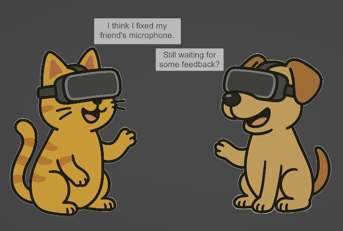

# XR AI Text To Speech Sample

A Unity XR sample project demonstrating AI text-to-speech functionality using OpenAI's TTS API.



## Features

- OpenAI Text-to-Speech integration
- Multiple TTS models support (tts-1, tts-1-hd, gpt-4o-mini-tts)
- Various voice options (alloy, echo, fable, onyx, nova, shimmer)
- Additional instructions for aspects of speech (accent, intonation, tone)

## OpenAI SDK

This project uses an independently developed OpenAI SDK for Unity: https://github.com/RageAgainstThePixel/com.openai.unity.

Find a description of the models via OpenAI: https://platform.openai.com/docs/guides/text-to-speech#text-to-speech-models.

## Setup

1. Clone or download this project
2. Open the project in Unity (tested with v6000.0.55f1)
3. Open `Resources/OpenAIConfiguration` in the inspector
4. Configure your OpenAI Api Key
5. Play the scene and click on a character to hear them speak!

⚠️ **Important**: Do not commit the `OpenAIConfiguration` file to version control as it contains your API key. Add it to your `.gitignore` file.

## Quick Overview

1. The `TTSBehaviour` orchestrates the text-to-speech and a little animation
2. `TTSOpenAI` is a reusable component integrated with Unity
3. Select different models and voices to try them out
4. Modify the text boxes for a different conversation
5. Edit the instructions

## Core Integration

### OpenAI SpeechRequest
```
public class TTSOpenAI
{
    ...

    public static IEnumerator ExecuteCoroutine(string text, string model, string voice, string instructions, Action<AudioClip> onComplete)
    {
        AudioClip result = null;

        SpeechRequest request = new(text, model, voice, instructions);
        Task<SpeechClip> speechClip = GetOpenAIClient().AudioEndpoint.GetSpeechAsync(request);

        while (!speechClip.IsCompleted) yield return null;

        if (speechClip.Exception != null)
        {
            Debug.LogError($"Error in TTSOpenAI.ExecuteCoroutine: {speechClip.Exception.Message}");
        }
        else
        {
            result = speechClip.Result.AudioClip;
        }

        onComplete?.Invoke(result);
    }
}
```

### Example Usage
```
public class TTSBehaviour : MonoBehaviour
{
    public void Speak()
    {
        StartCoroutine(TTSOpenAI.ExecuteCoroutine(text.text, model.GetDescription(), voice.ToString(), instructions, audioClip =>
        {
            if (audioClip != null)
            {
                audioSource.PlayOneShot(audioClip);
            }
        }));
    }
}